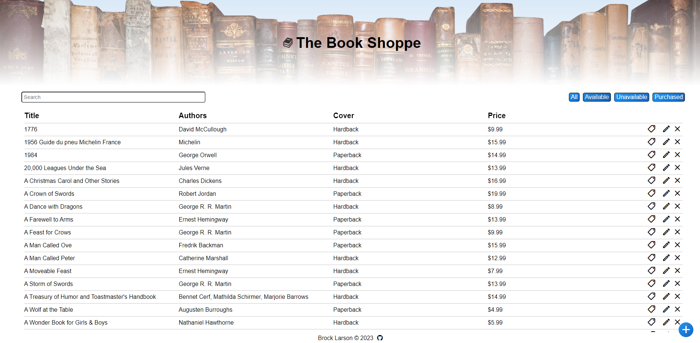

# Bookstore_Azure
Deployment of my Bookstore App onto Azure. This GitHub repository is for part of the Nucamp curriculum to record the deployment of my Bookstore app onto Azure.

Creation of Kubernetes Cluster on Azure:

Container Registry:

Container Repository:

Kubernetes Cluster Deployment:

Confirmation that service is running using Insomnia to run a HTTP POST request:

Confirmation that service is running using Insomnia to run a HTTP GET request:

Landing Page:

Add/Edit Book Form (Uses jQuery to run an ajax function to generate HTTP requests):
